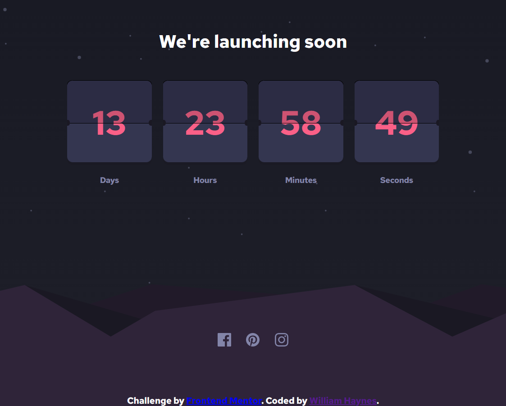

# Frontend Mentor - Launch countdown timer solution

This is a solution to the [Launch countdown timer challenge on Frontend Mentor](https://www.frontendmentor.io/challenges/launch-countdown-timer-N0XkGfyz-). Frontend Mentor challenges help you improve your coding skills by building realistic projects. 

## Table of contents

- [Overview](#overview)
  - [The challenge](#the-challenge)
  - [Screenshot](#screenshot)
  - [Links](#links)
- [My process](#my-process)
  - [Built with](#built-with)
  - [What I learned](#what-i-learned)
  - [Continued development](#continued-development)
  - [Useful resources](#useful-resources)
- [Author](#author)


## Overview

### The challenge

Users should be able to:

- See hover states for all interactive elements on the page
- See a live countdown timer that ticks down every second (start the count at 14 days)
- **Bonus**: When a number changes, make the card flip from the middle

### Screenshot




### Links

- Solution URL: (https://github.com/willrhyd/launch-countdown-timer-main)
- Live Site URL: (https://willrhyd.github.io/launch-countdown-timer-main/)

### Built with

- Semantic HTML5 markup
- CSS custom properties (3dtransform, transitions, Flexbox, overflow)
- setInterval
- UTCDate

### my-process

The timer works with four containers placed in a flexbox. Each container holds 2x top cards and 1x bottom card that are carefully
positioned to show half of a number at a given time, to create the separate card effect. Then to flip the card and change the number I used setInterval to update the values and toggle class to trigger the animation.

### What I learned

I learnt a bit about using flexbox, absolute/relative positioning, filter for svg images, and 3dtransforms for the flip along with a transition. on the JavaScript side I used setInterval and setTimeout to control the updating of the boxes.

```html
<div class="countdown-element">
      <div class="countdown-element-top">
        <p class="countdown-element-number-top">0</p>
      </div>
      <div class="countdown-element-top-next">
        <p class="countdown-element-number-top-next">0</p>
      </div>

      `is there a better way to do the notch in the middle?
      <div class="bevel-container">
        <div class="mid-left"></div>
        <div class="mid-right"></div>
      </div>
      <div class="countdown-element-bottom">
        <p class="countdown-element-number-bottom">0</p>
      </div>
    </div>
```
```css
.countdown-element-top-flipped{
    background: hsl(236, 21%, 26%);
    color: hsl(236, 21%, 26%);
    transform: rotateX(180deg);
    transform-origin: 0 100%;
    transform-style: preserve3d;
    transition: transform, color, ease, 0.3s;
    z-index: 2;
 }
```
```js
setInterval(function() {
  ` .toggle on the flipped class to initiate the flip animation`
  
    topFlipBox[3].classList.toggle("countdown-element-top-flipped")
    topFlipBox[3].style.visibility="visible"
    
    timer = new Date (timer - 1000);

    currentCountdownNumberTop[3].innerHTML = timer.getSeconds();
    currentCountdownNumberBottom[3].innerHTML = timer.getSeconds()

    setTimeout(function() {
        topFlipBox[3].classList.toggle("countdown-element-top-flipped")
        topFlipBox[3].style.visibility="hidden"
    }, 300);

 }, 1000); 
```

### Useful resources

- [CSS Filter](https://codepen.io/sosuke/pen/Pjoqqp) - This helped me get the correct Filter property for the hover animations on the social media icons.~


## Author

- Website - [William Haynes](https://willrhyd.github.io/personal/)
- Frontend Mentor - [@willrhyd](https://www.frontendmentor.io/profile/willrhyd)

